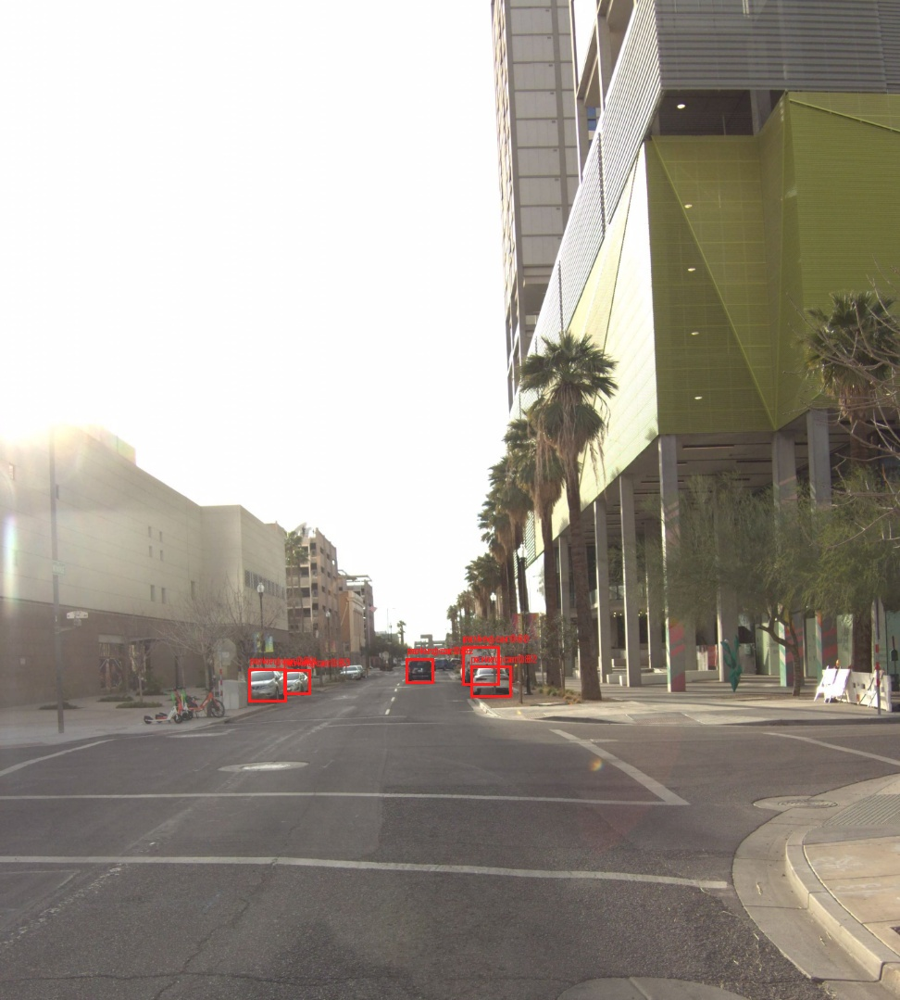
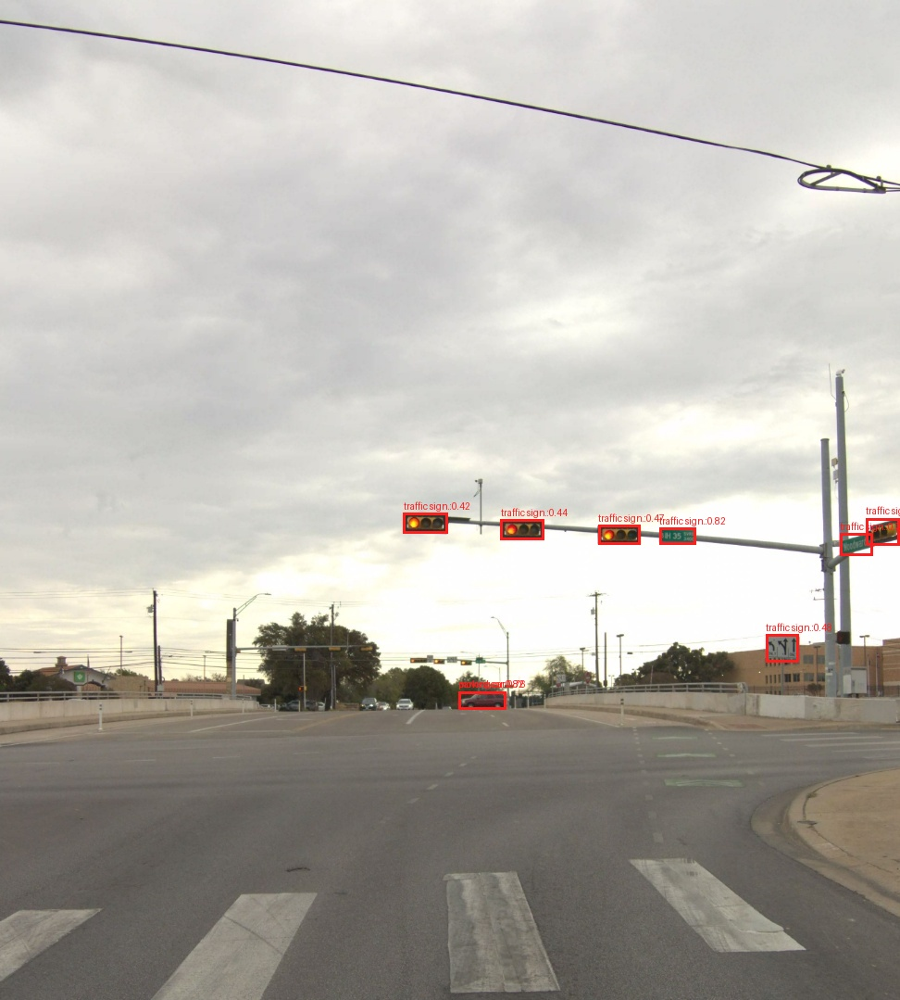
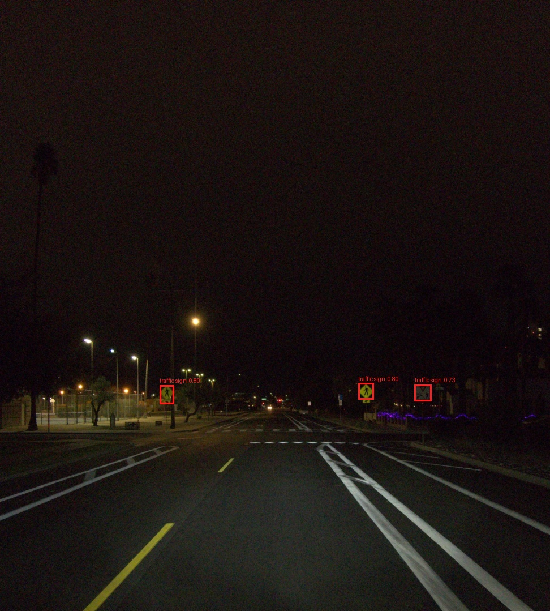
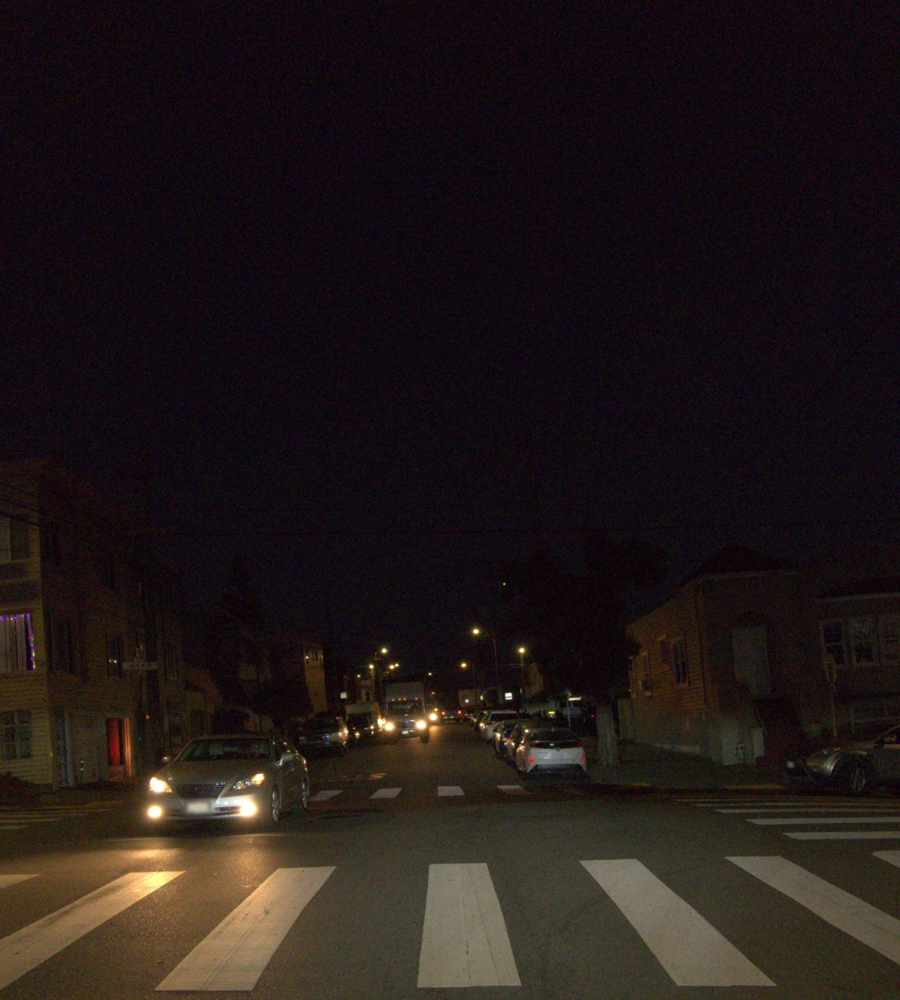
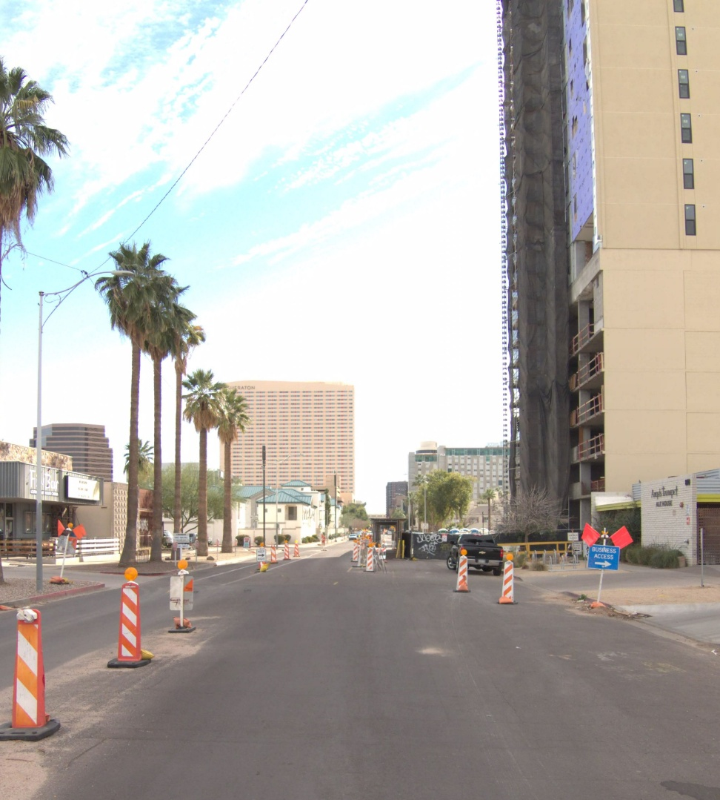
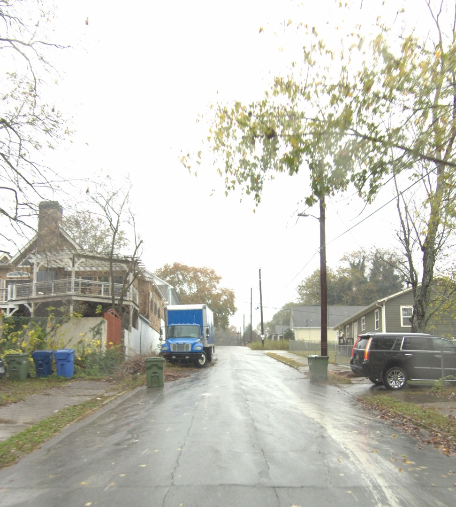
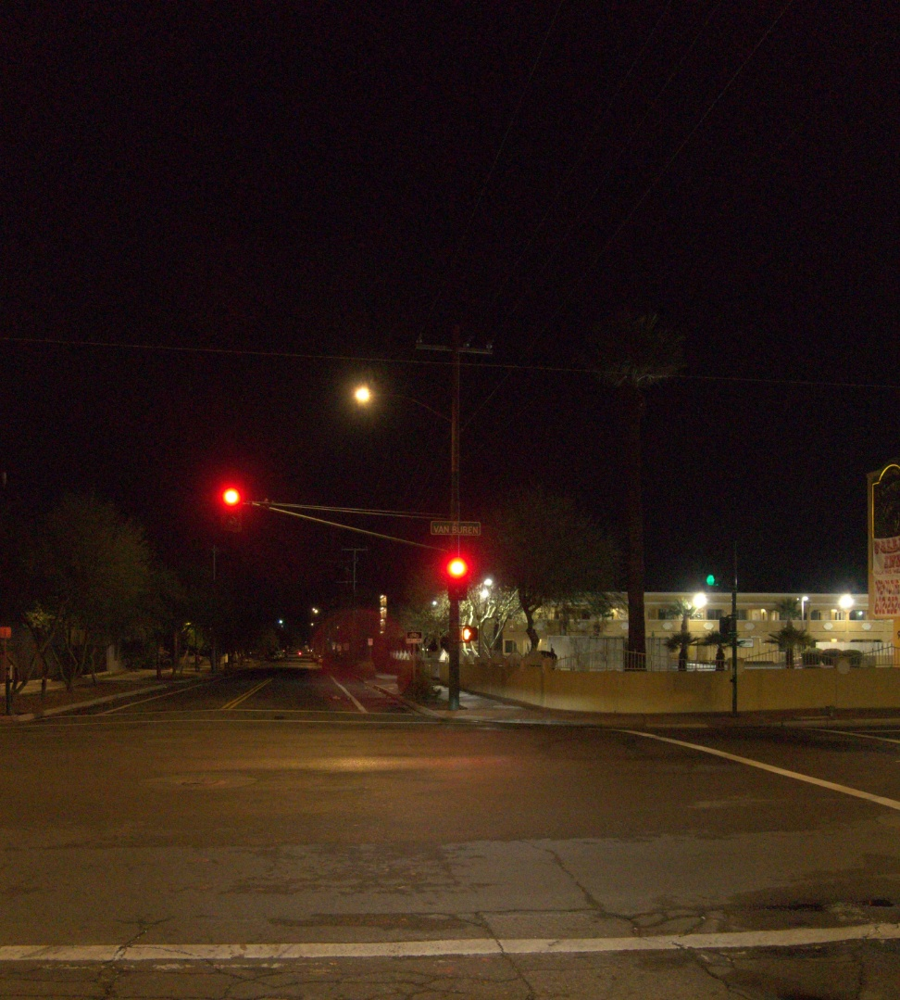

# Waymo E2E Validation Mini Showcase

This note summarizes representative Waymo E2E validation examples for tomorrow's benchmark discussion. The validation split has official scenario-cluster metadata, exported front-camera frames, ego future trajectories, and rater preference trajectories for selected frames.

## Dataset Snapshot

- Validation scenes: `479`
- Exported front-camera frames: `106360`
- Official scenario clusters: `10` categories
- Frames with valid rater preference trajectories: `479`
- SAM3 bbox visualizations are being generated under `annotations/segment_viz/`; completed visualizations are used below when available.

## Official Scenario Cluster Counts

| Scenario cluster | Scenes | Frames |
|---|---:|---:|
| Intersection | 116 | 25877 |
| Foreign Object Debris | 78 | 17127 |
| Cyclist | 71 | 15975 |
| Pedestrian | 52 | 11446 |
| Multi-Lane Maneuvers | 42 | 9317 |
| Single-Lane Maneuvers | 38 | 8499 |
| Special Vehicles | 25 | 5701 |
| Others | 22 | 4706 |
| Cut-ins | 20 | 4490 |
| Construction | 15 | 3222 |

## Representative Examples

### Example 1: Pedestrian

- Scene ID: `086adac6586a693811e6e0901532bc3c`
- Frame: `086adac6586a693811e6e0901532bc3c-009`
- Official cluster: `Pedestrian`
- Raw image: `/local1/rgao727/waymo_dataset/val/images/086adac6586a693811e6e0901532bc3c/CAM_FRONT/086adac6586a693811e6e0901532bc3c-009_FRONT.jpg`
- SAM3 bbox visualization: `/local1/rgao727/waymo_dataset/val/annotations/segment_viz/segment_001/086adac6586a693811e6e0901532bc3c-009_FRONT_boxes.jpg`

- Labels JSON: `/local1/rgao727/waymo_dataset/val/annotations/labels/086adac6586a693811e6e0901532bc3c-009.json`
- Ego status JSON: `/local1/rgao727/waymo_dataset/val/annotations/ego_status/086adac6586a693811e6e0901532bc3c-009.json`
- Camera calibration JSON: `/local1/rgao727/waymo_dataset/val/annotations/camera_calibration/086adac6586a693811e6e0901532bc3c-009.json`
- Preference trajectory scores: not valid for this frame (`-1` or empty).
- Benchmark angle: corner-case scene understanding and risk-aware perception.

### Example 2: Cyclist

- Scene ID: `0824d90db4395e53f693374259e5b1d8`
- Frame: `0824d90db4395e53f693374259e5b1d8-122`
- Official cluster: `Cyclist`
- Raw image: `/local1/rgao727/waymo_dataset/val/images/0824d90db4395e53f693374259e5b1d8/CAM_FRONT/0824d90db4395e53f693374259e5b1d8-122_FRONT.jpg`
- SAM3 bbox visualization: `/local1/rgao727/waymo_dataset/val/annotations/segment_viz/segment_001/0824d90db4395e53f693374259e5b1d8-122_FRONT_boxes.jpg`

- Labels JSON: `/local1/rgao727/waymo_dataset/val/annotations/labels/0824d90db4395e53f693374259e5b1d8-122.json`
- Ego status JSON: `/local1/rgao727/waymo_dataset/val/annotations/ego_status/0824d90db4395e53f693374259e5b1d8-122.json`
- Camera calibration JSON: `/local1/rgao727/waymo_dataset/val/annotations/camera_calibration/0824d90db4395e53f693374259e5b1d8-122.json`
- Preference trajectory scores: not valid for this frame (`-1` or empty).
- Benchmark angle: corner-case scene understanding and risk-aware perception.

### Example 3: Foreign Object Debris

- Scene ID: `0075c28f1f1a68c4c1c8dcf37958046b`
- Frame: `0075c28f1f1a68c4c1c8dcf37958046b-029`
- Official cluster: `Foreign Object Debris`
- Raw image: `/local1/rgao727/waymo_dataset/val/images/0075c28f1f1a68c4c1c8dcf37958046b/CAM_FRONT/0075c28f1f1a68c4c1c8dcf37958046b-029_FRONT.jpg`
- SAM3 bbox visualization: `/local1/rgao727/waymo_dataset/val/annotations/segment_viz/segment_000/0075c28f1f1a68c4c1c8dcf37958046b-029_FRONT_boxes.jpg`

- Labels JSON: `/local1/rgao727/waymo_dataset/val/annotations/labels/0075c28f1f1a68c4c1c8dcf37958046b-029.json`
- Ego status JSON: `/local1/rgao727/waymo_dataset/val/annotations/ego_status/0075c28f1f1a68c4c1c8dcf37958046b-029.json`
- Camera calibration JSON: `/local1/rgao727/waymo_dataset/val/annotations/camera_calibration/0075c28f1f1a68c4c1c8dcf37958046b-029.json`
- Preference trajectory scores: not valid for this frame (`-1` or empty).
- Benchmark angle: corner-case scene understanding and risk-aware perception.

### Example 4: Intersection

- Scene ID: `4b390f75983c892cbb4144d5af260054`
- Frame: `4b390f75983c892cbb4144d5af260054-148`
- Official cluster: `Intersection`
- Source label spelling: `Interections`
- Raw image: `/local1/rgao727/waymo_dataset/val/images/4b390f75983c892cbb4144d5af260054/CAM_FRONT/4b390f75983c892cbb4144d5af260054-148_FRONT.jpg`
- SAM3 bbox visualization: not available yet for this exact scene/frame

- Labels JSON: `/local1/rgao727/waymo_dataset/val/annotations/labels/4b390f75983c892cbb4144d5af260054-148.json`
- Ego status JSON: `/local1/rgao727/waymo_dataset/val/annotations/ego_status/4b390f75983c892cbb4144d5af260054-148.json`
- Camera calibration JSON: `/local1/rgao727/waymo_dataset/val/annotations/camera_calibration/4b390f75983c892cbb4144d5af260054-148.json`
- Preference trajectory scores: `5.0, 8.0, 6.0`
- Candidate endpoints: `(0.02, 0.07), (17.9, -0.04), (10.85, -0.78)`
- Score gap: `3.0`
- Benchmark angle: trajectory-choice and counterfactual driving preference.

### Example 5: Construction

- Scene ID: `14f0b68cf50bad87e90a490a70109cad`
- Frame: `14f0b68cf50bad87e90a490a70109cad-149`
- Official cluster: `Construction`
- Raw image: `/local1/rgao727/waymo_dataset/val/images/14f0b68cf50bad87e90a490a70109cad/CAM_FRONT/14f0b68cf50bad87e90a490a70109cad-149_FRONT.jpg`
- SAM3 bbox visualization: not available yet for this exact scene/frame

- Labels JSON: `/local1/rgao727/waymo_dataset/val/annotations/labels/14f0b68cf50bad87e90a490a70109cad-149.json`
- Ego status JSON: `/local1/rgao727/waymo_dataset/val/annotations/ego_status/14f0b68cf50bad87e90a490a70109cad-149.json`
- Camera calibration JSON: `/local1/rgao727/waymo_dataset/val/annotations/camera_calibration/14f0b68cf50bad87e90a490a70109cad-149.json`
- Preference trajectory scores: `10.0, 9.0, 5.0`
- Candidate endpoints: `(31.67, 1.91), (17.69, 0.14), (36.74, 2.19)`
- Score gap: `5.0`
- Benchmark angle: trajectory-choice and counterfactual driving preference.

### Example 6: Cut-ins

- Scene ID: `07b4716982f88d85c6e5b350883b2d9b`
- Frame: `07b4716982f88d85c6e5b350883b2d9b-147`
- Official cluster: `Cut-ins`
- Source label spelling: `Cut_ins`
- Raw image: `/local1/rgao727/waymo_dataset/val/images/07b4716982f88d85c6e5b350883b2d9b/CAM_FRONT/07b4716982f88d85c6e5b350883b2d9b-147_FRONT.jpg`
- SAM3 bbox visualization: not available yet for this exact scene/frame

- Labels JSON: `/local1/rgao727/waymo_dataset/val/annotations/labels/07b4716982f88d85c6e5b350883b2d9b-147.json`
- Ego status JSON: `/local1/rgao727/waymo_dataset/val/annotations/ego_status/07b4716982f88d85c6e5b350883b2d9b-147.json`
- Camera calibration JSON: `/local1/rgao727/waymo_dataset/val/annotations/camera_calibration/07b4716982f88d85c6e5b350883b2d9b-147.json`
- Preference trajectory scores: `10.0, 8.0, 9.0`
- Candidate endpoints: `(45.29, -1.21), (16.21, -0.16), (49.7, -1.57)`
- Score gap: `2.0`
- Benchmark angle: trajectory-choice and counterfactual driving preference.

### Example 7: Multi-Lane Maneuvers

- Scene ID: `d5fa64f6a8c44c60aaec7b07776e23c4`
- Frame: `d5fa64f6a8c44c60aaec7b07776e23c4-150`
- Official cluster: `Multi-Lane Maneuvers`
- Raw image: `/local1/rgao727/waymo_dataset/val/images/d5fa64f6a8c44c60aaec7b07776e23c4/CAM_FRONT/d5fa64f6a8c44c60aaec7b07776e23c4-150_FRONT.jpg`
- SAM3 bbox visualization: not available yet for this exact scene/frame

- Labels JSON: `/local1/rgao727/waymo_dataset/val/annotations/labels/d5fa64f6a8c44c60aaec7b07776e23c4-150.json`
- Ego status JSON: `/local1/rgao727/waymo_dataset/val/annotations/ego_status/d5fa64f6a8c44c60aaec7b07776e23c4-150.json`
- Camera calibration JSON: `/local1/rgao727/waymo_dataset/val/annotations/camera_calibration/d5fa64f6a8c44c60aaec7b07776e23c4-150.json`
- Preference trajectory scores: `10.0, 8.0, 5.0`
- Candidate endpoints: `(0.14, -0.01), (11.45, -6.83), (12.68, -12.06)`
- Score gap: `5.0`
- Benchmark angle: trajectory-choice and counterfactual driving preference.

## How This Supports New Benchmark Questions

- Perception questions can use `CAM_FRONT` frames plus SAM3 bbox visualizations for object presence, relative position, and risk cues.
- Scenario-cluster questions can target official categories such as Pedestrian, Cyclist, Construction, Cut-ins, and Foreign Object Debris.
- Preference questions can use frames with valid `preference_score` to ask which candidate trajectory is safest or most appropriate.
- Counterfactual questions can contrast high-score and low-score trajectories, especially when the score gap is large.
